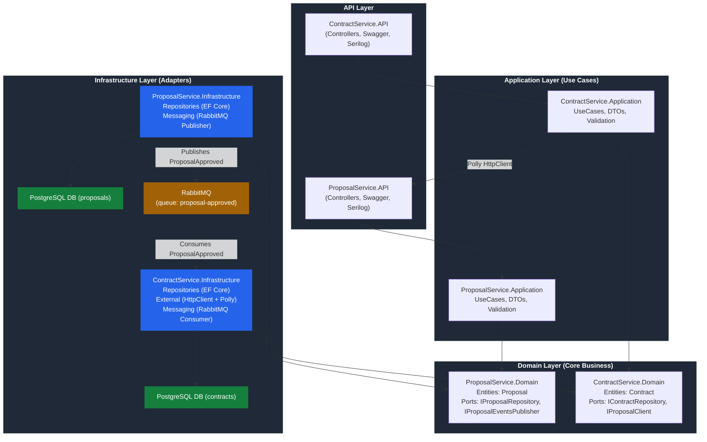

```mermaid

flowchart TB

    %% Layers
    subgraph API_LAYER["API Layer"]
        A1["ProposalService.API\n(Controllers, Swagger, Serilog)"]
        A2["ContractService.API\n(Controllers, Swagger, Serilog)"]
    end

    subgraph APPLICATION_LAYER["Application Layer (Use Cases)"]
        AP1["ProposalService.Application\nUseCases, DTOs, Validation"]
        AC1["ContractService.Application\nUseCases, DTOs, Validation"]
    end

    subgraph DOMAIN_LAYER["Domain Layer (Core Business)"]
        DP["ProposalService.Domain\nEntities: Proposal\nPorts: IProposalRepository, IProposalEventsPublisher"]
        DC["ContractService.Domain\nEntities: Contract\nPorts: IContractRepository, IProposalClient"]
    end

    subgraph INFRA_LAYER["Infrastructure Layer (Adapters)"]
        IP1["ProposalService.Infrastructure\nRepositories (EF Core)\nMessaging (RabbitMQ Publisher)"]
        IC1["ContractService.Infrastructure\nRepositories (EF Core)\nExternal (HttpClient + Polly)\nMessaging (RabbitMQ Consumer)"]
        DB1["PostgreSQL DB (proposals)"]
        DB2["PostgreSQL DB (contracts)"]
        MQ["RabbitMQ\n(queue: proposal-approved)"]
    end

    %% Connections
    A1 --> AP1
    A2 --> AC1

    AP1 --> DP
    AC1 --> DC

    IP1 --> DP
    IC1 --> DC

    IP1 --> DB1
    IC1 --> DB2

    %% Messaging
    IP1 -. Publishes ProposalApproved .-> MQ
    MQ -. Consumes ProposalApproved .-> IC1

    %% External call
    AC1 -->|Polly HttpClient| A1

    %% Styling
    classDef layer fill:#1f2937,stroke:#fff,stroke-width:0px,color:#fff,font-weight:bold;
    classDef adapter fill:#2563eb,stroke:#fff,stroke-width:0px,color:#fff;
    classDef db fill:#15803d,stroke:#fff,stroke-width:0px,color:#fff;
    classDef queue fill:#a16207,stroke:#fff,stroke-width:0px,color:#fff;

    class API_LAYER,APPLICATION_LAYER,DOMAIN_LAYER,INFRA_LAYER layer;
    class IP1,IC1 adapter;
    class DB1,DB2 db;
    class MQ queue;
```
