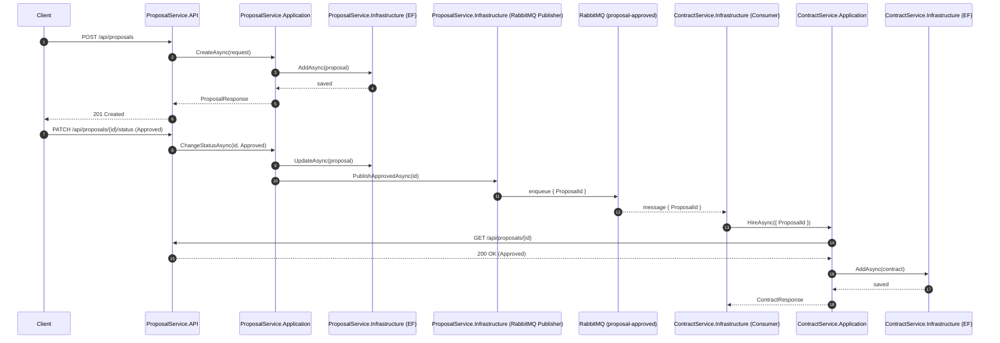

## Happy Path (Approve → Event → Hire)

```mermaid
sequenceDiagram
    autonumber
    participant Client as Client
    participant API_P as ProposalService.API
    participant App_P as ProposalService.Application
    participant Repo_P as ProposalService.Infrastructure (EF)
    participant Pub as ProposalService.Infrastructure (RabbitMQ Publisher)
    participant MQ as RabbitMQ (proposal-approved)
    participant Cons as ContractService.Infrastructure (Consumer)
    participant App_C as ContractService.Application
    participant Repo_C as ContractService.Infrastructure (EF)

    Client->>API_P: POST /api/proposals
    API_P->>App_P: CreateAsync(request)
    App_P->>Repo_P: AddAsync(proposal)
    Repo_P-->>App_P: saved
    App_P-->>API_P: ProposalResponse
    API_P-->>Client: 201 Created

    Client->>API_P: PATCH /api/proposals/{id}/status (Approved)
    API_P->>App_P: ChangeStatusAsync(id, Approved)
    App_P->>Repo_P: UpdateAsync(proposal)
    App_P->>Pub: PublishApprovedAsync(id)
    Pub->>MQ: enqueue { ProposalId }

    MQ-->>Cons: message { ProposalId }
    Cons->>App_C: HireAsync({ ProposalId })
    App_C->>API_P: GET /api/proposals/{id}
    API_P-->>App_C: 200 OK (Approved)
    App_C->>Repo_C: AddAsync(contract)
    Repo_C-->>App_C: saved
    App_C-->>Cons: ContractResponse
```
